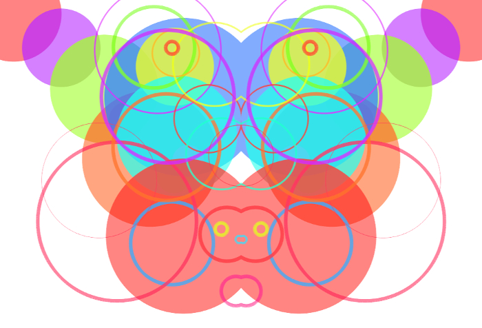

## Drawing symmetries



This sketch draws on the right side of the screen what was drawn in the left side.

## Exercise

Make your own symmetryc drawing app, the wilder&weirder, the better. 

- Have a look at the `drawCircle` method. Implement your own draw method drawing something that is not a circle. You can find help about the tecnical implementation in these chapters of the ofBook, [1](http://openframeworks.cc/ofBook/chapters/intro_to_graphics.html#brusheswithbasicshapes) & [2](http://openframeworks.cc/ofBook/chapters/lines.html#drawaline) or in the `examples/graphics` folder.
- These lines flip the FBO horizontally:

```cpp
ofTexture flipped = fbo.getTexture();
float pos = ofGetWidth() / 2.;
flipped.draw(ofGetWidth(), 0, -pos, ofGetHeight());
```

Can you imagine other ways to divide the screen maintaining a kind of simmetry?

- The app draws circles dragging the mouse. Which other types of interaction can you imagine?

- The color is set in HSB color space. Have a look at the [documentation](http://openframeworks.cc/documentation/types/ofColor) to understand how you can change the color in your application.

### You will learn

`FBOs`, color spaces, coordinate system, `ofMap`, `sin`, `glm::distance`, `ofSetCircleResolution`, `ofSetLineWidth`, `ofPushStyle`, `ofPopStyle`, `ofSetColor`

### References

[Rorschach test](https://en.wikipedia.org/wiki/Rorschach_test)

[Symmetry in Biology](https://en.wikipedia.org/wiki/Symmetry_in_biology)

[Symmetry in ancient Egyptian art](http://www.gizapower.com/Plate%204.jpg)
