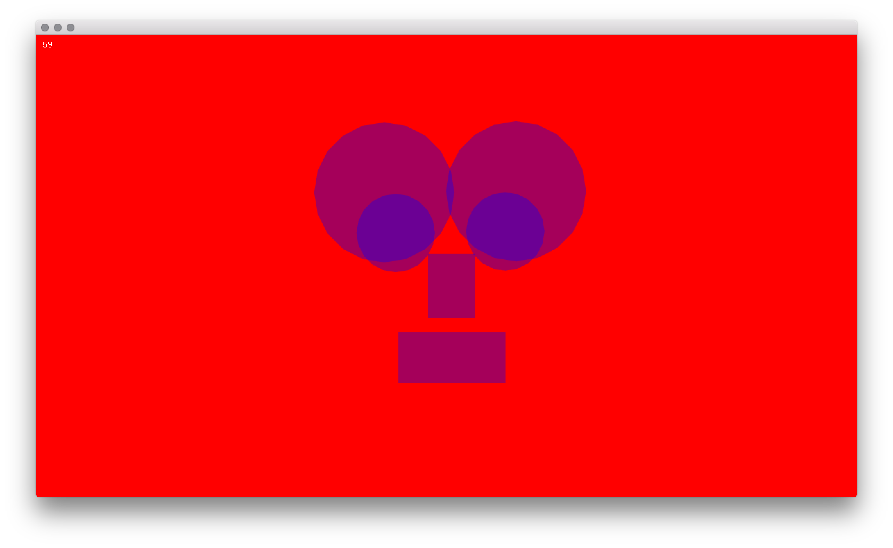

# Mirage of mirrors

> Mirrors and copulation are abominable, since they both multiply the numbers of men...

*Jorge Luis Borges,  from "Tlön, Uqbar, Orbis Tertius", 1940*

What remains of a mirror after its removal? Is it possible to symbolise a mirror without showing it?
The goal of this course is to define the mirror as software, which reflects ray of lights, duplicates and distorts images, and can displace our face on an infinity of surfaces.

Picture from *Kader Attia "Holy Land", 2006*

## Contents

- Rays

| --            |  -- |
:-------------------------:|:-------------------------:
  |  
  |  

- Faces

| --            |  -- |
:-------------------------:|:-------------------------:
  |  
  |  

- Symmetries

| --            |  -- |
:-------------------------:|:-------------------------:
  |  
  |  

## Learning Resources

- [The openFrameworks book](http://openframeworks.cc/ofBook/chapters/intro_to_graphics.html)
- [The openFrameworks forum](https://forum.openframeworks.cc/)
- [The openFrameworks official documentation](http://openframeworks.cc/documentation/)
- The `examples` folder in your openFrameworks installation
